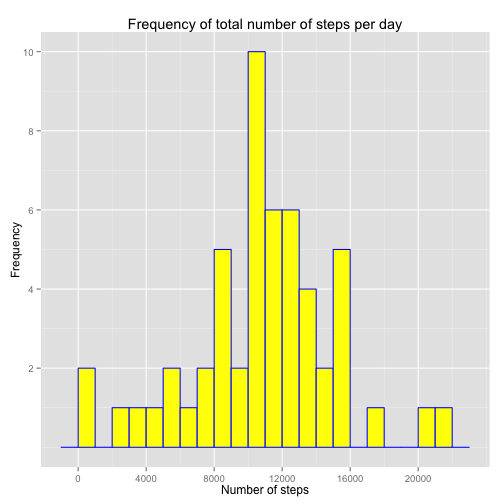
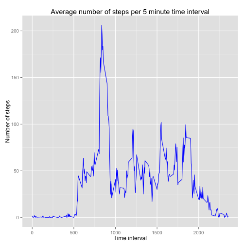
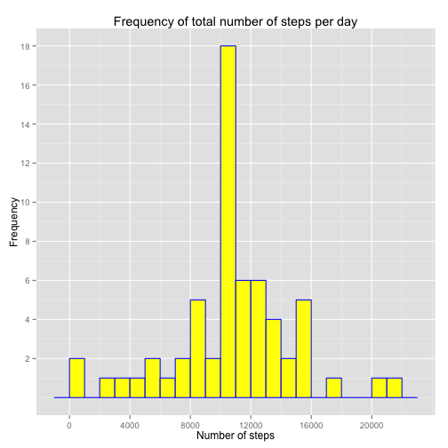
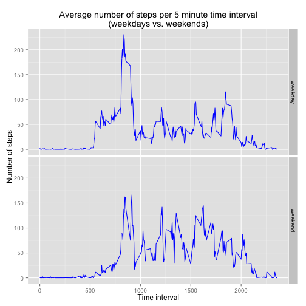

#Reproducible Research - Peer Assessment 1#

###Introduction###
This assignment makes use of data from a personal activity monitoring device. This device collects data at 5 minute intervals through out the day. The data consists of two months of data from an anonymous individual collected during the months of October and November, 2012 and include the number of steps taken in 5 minute intervals each day.

The variables included in the dataset are:

- steps: Number of steps taking in a 5-minute interval (missing values are coded as NA)
- date: The date on which the measurement was taken in YYYY-MM-DD format
- interval: Identifier for the 5-minute interval in which measurement was taken

The dataset is stored in a comma-separated-value (activity.CSV) file and there are a total of 17,568 observations in this dataset.

This R markdown file lists all the instructions needed to complete the project.

###Loading and preprocessing the data###
- Loading libraries for data frame and graphics manipulation:

```r
library(plyr)
library(ggplot2)
library(knitr)
opts_chunk$set(echo = TRUE)
```

- Loading data and investigating classes:

```r
activity <- read.csv("activity.csv", header = TRUE)
str(activity)
```

```
## 'data.frame':	17568 obs. of  3 variables:
##  $ steps   : int  NA NA NA NA NA NA NA NA NA NA ...
##  $ date    : Factor w/ 61 levels "2012-10-01","2012-10-02",..: 1 1 1 1 1 1 1 1 1 1 ...
##  $ interval: int  0 5 10 15 20 25 30 35 40 45 ...
```

- Converting the date variable to the proper date format:

```r
activity$date <- as.Date(activity$date, format = "%Y-%m-%d")
str(activity)
```

```
## 'data.frame':	17568 obs. of  3 variables:
##  $ steps   : int  NA NA NA NA NA NA NA NA NA NA ...
##  $ date    : Date, format: "2012-10-01" "2012-10-01" ...
##  $ interval: int  0 5 10 15 20 25 30 35 40 45 ...
```

###What is mean total number of steps taken per day?###
- Subsetting rows where the variable steps is not NA (NA values will be dealt with at a later stage) then aggregating number of steps by day:

```r
activity_clean <- subset(activity, !is.na(steps))
activity_by_day <- ddply(activity_clean[,1:2], .(date), summarise, steps = sum(steps))
```

- Building graphics:

```r
graph1 <- ggplot(activity_by_day, aes(x = steps)) +
          geom_histogram(colour ="blue", fill = "yellow", binwidth=1000) +
          scale_x_continuous(breaks = c(0, 4000, 8000, 12000, 16000, 20000)) +
          scale_y_continuous(breaks = c(2,4,6,8,10)) + 
          labs(title = "Frequency of total number of steps per day", 
               x = "Number of steps", y = "Frequency")
print(graph1)
```

 

- Calculating mean and median:

```r
mean(activity_by_day$steps)
```

```
## [1] 10766.19
```

```r
median(activity_by_day$steps)
```

```
## [1] 10765
```

###What is the average daily activity pattern?###
- Averaging number of steps taken per time interval across all days:

```r
activity_by_interval <- ddply(activity_clean[, c("steps", "interval")], .(interval),
                              summarise, steps = mean(steps))
```

- Building graphics:

```r
graph2 <- ggplot(activity_by_interval, aes(x = interval, y = steps)) +
          geom_line(color = "blue") +
          labs(title = "Average number of steps per 5 minute time interval", 
               x = "Time interval", y = "Number of steps")
print(graph2)
```

 

- The interval containing the maximum number of steps turns out to be the following:

```r
activity_by_interval[activity_by_interval$steps == max(activity_by_interval$steps), ]
```

```
##     interval    steps
## 104      835 206.1698
```

###Imputing missing values###
- Calculating the total number of rows where steps value is missing:

```r
sum(is.na(activity$steps))
```

```
## [1] 2304
```

- I decided to replace the missing values with the mean per time interval across all days. To do so, I applied the function ```return_mean``` that I created to all the rows in the ```activity``` data frame: if the steps variable has a value, then the same is returned; otherwise, the mean value from the ```activity_by_interval``` data frame is returned based on the interval variable:

```r
return_mean <- function (interval, steps) {
  if(!is.na(steps)) steps
  else activity_by_interval[activity_by_interval$interval == interval,]$steps 
}
activity_full <- ddply(activity, .(date, interval), mutate, steps = return_mean(interval, steps))
```

- Building graphics:

```r
activity_by_day_full <- ddply(activity_full[,1:2], .(date), summarise, 
                              steps = sum(steps))
graph3 <- ggplot(activity_by_day_full, aes(x = steps)) +
          geom_histogram(colour ="blue", fill = "yellow", binwidth=1000) +
          scale_x_continuous(breaks = c(0, 4000, 8000, 12000, 16000, 20000)) +
          scale_y_continuous(breaks = c(2,4,6,8,10,12,14,16,18)) + 
          labs(title = "Frequency of total number of steps per day", 
               x = "Number of steps", y = "Frequency")
print(graph3)
```

 

- Calculating mean and median; the mean appears to be the same value as above while the median now equals the mean, differently from above:

```r
mean(activity_by_day_full$steps)
```

```
## [1] 10766.19
```

```r
median(activity_by_day_full$steps)
```

```
## [1] 10766.19
```

###Are there differences in activity patterns between weekdays and weekends?###
- Creating a new factor variable from the date variable, consisting in only two levels, one for weekdays and one for weekends:

```r
activity_full$weekday <- as.factor(weekdays(activity_full$date))
levels(activity_full$weekday) <- list(
    "weekday" = c("Monday", "Tuesday", "Wednesday", "Thursday", "Friday"),
    "weekend" = c("Saturday", "Sunday"))
```

- Subsetting data and building graphics:

```r
activity_by_week_factor <- ddply(activity_full[, c("steps", "interval", "weekday")],
                                 .(interval, weekday), summarise, steps = mean(steps))
graph4 <- ggplot(activity_by_week_factor, aes(x=interval, y=steps)) +
          geom_line(colour = "blue") +
          labs(title = "Average number of steps per 5 minute time interval\n(weekdays vs. weekends)",
               x = "Time interval", y = "Number of steps") +
          facet_grid(weekday ~ .)
print(graph4)
```

 
